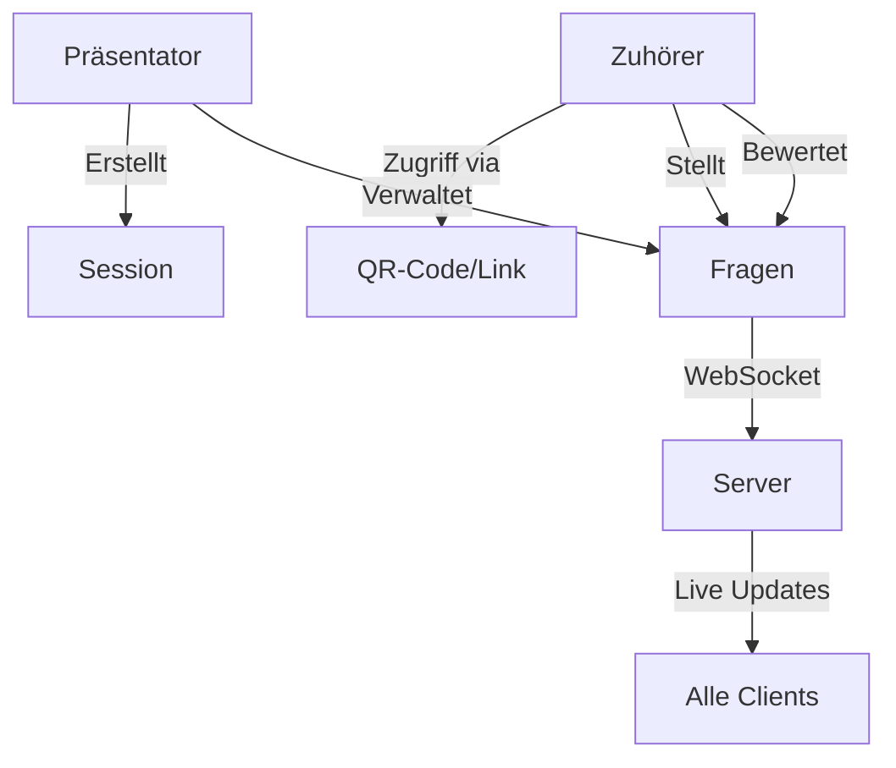
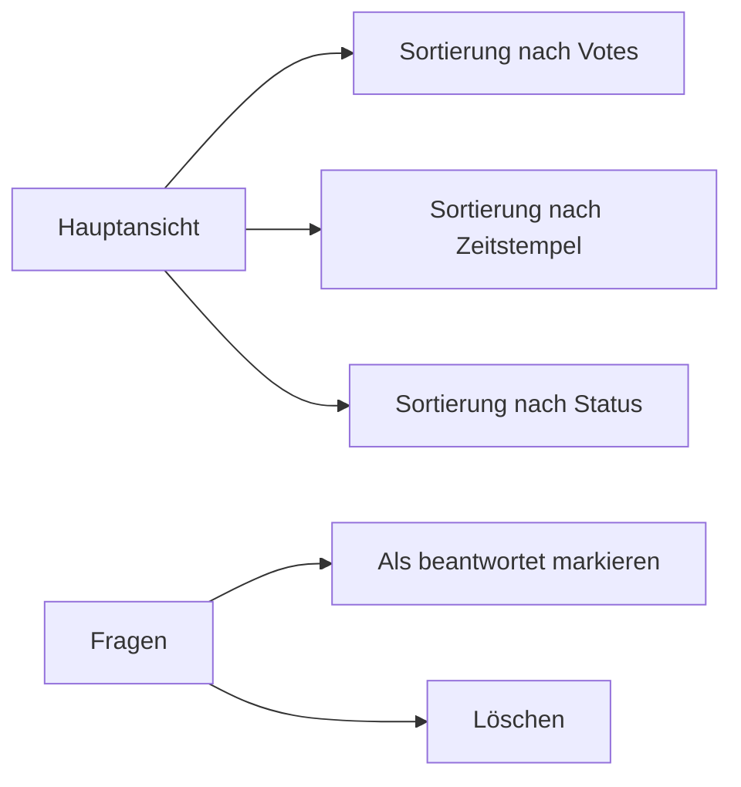
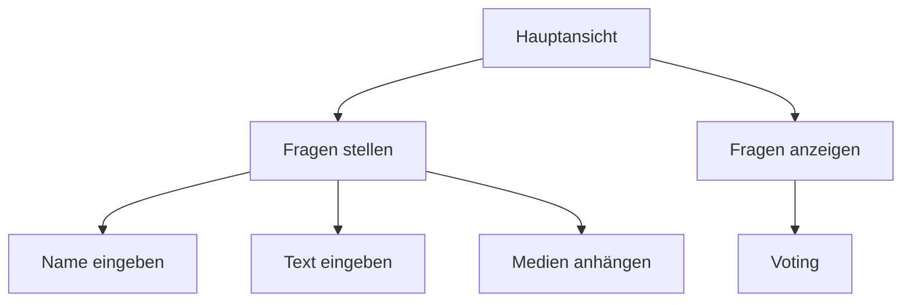
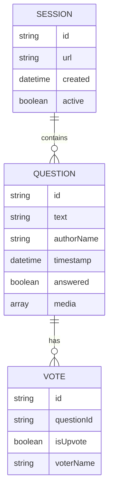
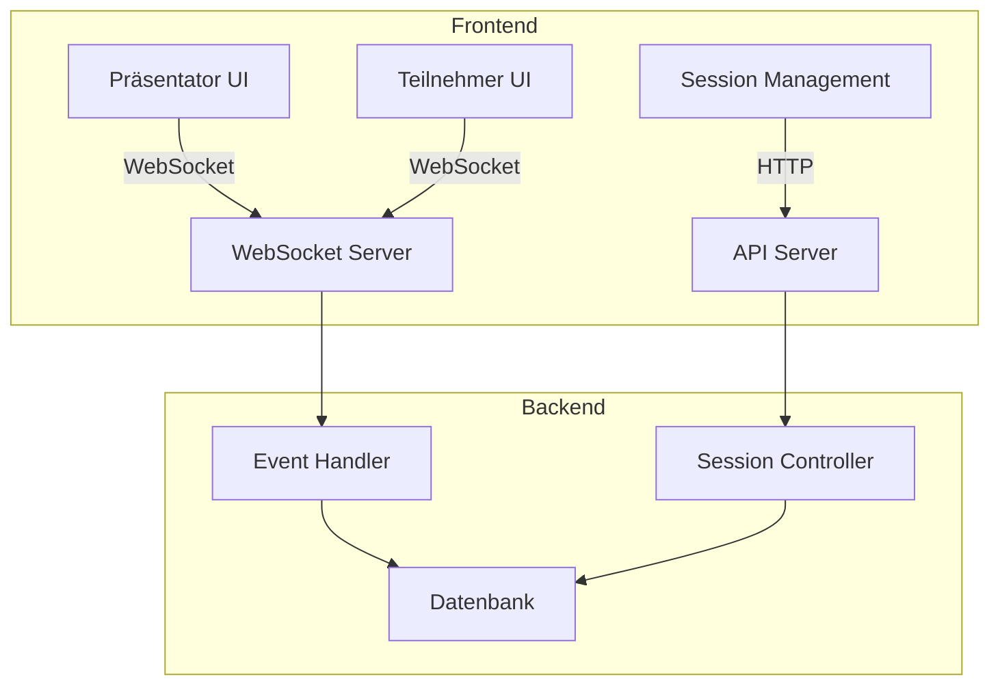

**User:**

<task>
Stell mir bitte eine Frage nach der anderen, damit wir eine gründliche, schrittweise Spezifikation für diese Idee entwickeln können. Jede Frage sollte auf meinen vorherigen Antworten aufbauen, und unser Endziel ist eine detaillierte Spezifikation, die ich an einen Entwickler weitergeben kann. Lass uns das iterativ angehen und uns in jedes relevante Detail vertiefen. Denk daran, immer nur eine Frage auf einmal. 

Hier ist die Idee: Ich möchte eine Webseite die es ermöglicht, dass Zuhörer während einer Präsentation Fragen einreichen können. Die Fragen sollen öffentlich sichtbar sein, es soll abgestimmt werden können.
</task>
<environment_details>
# VSCode Visible Files


# VSCode Open Tabs


# Current Time
5.4.2025, 1:11:26 PM (Europe/Berlin, UTC+2:00)

# Current Context Size (Tokens)
(Not available)

# Current Cost
$0.00

# Current Mode
<slug>architect</slug>
<name>Architect</name>


# Current Working Directory (/home/sebastian/projects/agenticai) Files
.gitignore
</environment_details>

---

**Assistant:**

<thinking>
Da der Benutzer eine schrittweise Spezifikation für eine Q&A-Plattform für Präsentationen wünscht, sollte ich mit grundlegenden Fragen beginnen und dann in die Details eintauchen. Die erste Frage sollte sich auf den Zugang zur Plattform konzentrieren, da dies fundamental für die weitere Planung ist.
</thinking>

<ask_followup_question>
<question>Wie sollen die Zuhörer Zugang zur Plattform erhalten? Hier sind einige mögliche Ansätze:</question>
<follow_up>
<suggest>
Über einen QR-Code oder kurzen Link, den der Präsentierende zu Beginn einblendet - keine Registrierung erforderlich
</suggest>
<suggest>
Über einen personalisierten Link, den die Teilnehmer vorab per E-Mail erhalten - mit Registrierung/Login
</suggest>
<suggest>
Über einen Zugangscode, den der Präsentierende zu Beginn mitteilt - einfache Eingabe ohne Registrierung
</suggest>
</follow_up>
</ask_followup_question>

---

**User:**

[ask_followup_question for 'Wie sollen die Zuhörer Zugang zur Plattform erhalten? Hier sind einige mögliche Ansätze:'] Result:
<answer>
Über einen kurzen Link oder QR Code
</answer>
<environment_details>
# VSCode Visible Files


# VSCode Open Tabs


# Current Time
5.4.2025, 1:11:54 PM (Europe/Berlin, UTC+2:00)

# Current Context Size (Tokens)
10.839 (5%)

# Current Cost
$0.04

# Current Mode
<slug>architect</slug>
<name>Architect</name>
</environment_details>

---

**Assistant:**

<thinking>
Da der Zugang über einen kurzen Link oder QR-Code erfolgen soll, ist der nächste logische Schritt die Frage nach der Identifikation der Teilnehmer. Dies ist wichtig für die Funktionalität des Abstimmungssystems und die Moderation der Fragen.
</thinking>

<ask_followup_question>
<question>Wie sollen sich die Teilnehmer auf der Plattform identifizieren, wenn sie eine Frage stellen möchten?</question>
<follow_up>
<suggest>
Anonyme Teilnahme - keine Namensangabe erforderlich
</suggest>
<suggest>
Einfache Namenseingabe beim Stellen einer Frage - ohne Verifizierung
</suggest>
<suggest>
Pseudonym/Nickname - selbst gewählt beim ersten Zugriff auf die Plattform
</suggest>
</follow_up>
</ask_followup_question>

---

**User:**

[ask_followup_question for 'Wie sollen sich die Teilnehmer auf der Plattform identifizieren, wenn sie eine Frage stellen möchten?'] Result:
<answer>
Einfache Namenseingabe ohne Verifizierung.
</answer>
<environment_details>
# VSCode Visible Files


# VSCode Open Tabs


# Current Time
5.4.2025, 1:12:35 PM (Europe/Berlin, UTC+2:00)

# Current Context Size (Tokens)
11.256 (6%)

# Current Cost
$0.05

# Current Mode
<slug>architect</slug>
<name>Architect</name>
</environment_details>

---

**Assistant:**

<thinking>
Da wir nun wissen, dass eine einfache Namenseingabe ohne Verifizierung gewünscht ist, sollten wir uns den Funktionen des Abstimmungssystems widmen. Dies ist ein wichtiger Aspekt für die Priorisierung der Fragen und die Interaktion der Teilnehmer.
</thinking>

<ask_followup_question>
<question>Welche Funktionen soll das Abstimmungssystem für die Fragen haben?</question>
<follow_up>
<suggest>
Einfaches Upvoting (+1) für Fragen, die andere interessant finden
</suggest>
<suggest>
Up- und Downvoting (+/-) mit Anzeige des Gesamtscores
</suggest>
<suggest>
5-Sterne-Bewertungssystem für die Wichtigkeit der Fragen
</suggest>
</follow_up>
</ask_followup_question>

---

**User:**

[ask_followup_question for 'Welche Funktionen soll das Abstimmungssystem für die Fragen haben?'] Result:
<answer>
up und downvoting.
</answer>
<environment_details>
# VSCode Visible Files


# VSCode Open Tabs


# Current Time
5.4.2025, 1:12:58 PM (Europe/Berlin, UTC+2:00)

# Current Context Size (Tokens)
11.677 (6%)

# Current Cost
$0.06

# Current Mode
<slug>architect</slug>
<name>Architect</name>
</environment_details>

---

**Assistant:**

<thinking>
Da wir nun wissen, dass ein Up- und Downvoting-System implementiert werden soll, sollten wir uns der Moderation der Fragen zuwenden. Dies ist wichtig für die Kontrolle des Inhalts und die Organisation während der Präsentation.
</thinking>

<ask_followup_question>
<question>Wie sollen die eingereichten Fragen moderiert werden können?</question>
<follow_up>
<suggest>
Automatische Anzeige aller Fragen - der Präsentierende kann einzelne Fragen nachträglich löschen
</suggest>
<suggest>
Moderations-Interface für den Präsentierenden - Fragen müssen erst freigegeben werden, bevor sie öffentlich erscheinen
</suggest>
<suggest>
Hybrid-System - Fragen erscheinen sofort, können aber vom Präsentierenden als "beantwortet" markiert oder ausgeblendet werden
</suggest>
</follow_up>
</ask_followup_question>

---

**User:**

[ask_followup_question for 'Wie sollen die eingereichten Fragen moderiert werden können?'] Result:
<answer>
automatische Anzeige aller Fragen.
</answer>
<environment_details>
# VSCode Visible Files


# VSCode Open Tabs


# Current Time
5.4.2025, 1:13:16 PM (Europe/Berlin, UTC+2:00)

# Current Context Size (Tokens)
12.088 (6%)

# Current Cost
$0.07

# Current Mode
<slug>architect</slug>
<name>Architect</name>
</environment_details>

---

**Assistant:**

<thinking>
Da die Fragen automatisch angezeigt werden sollen, ist es wichtig zu klären, wie die Ansicht für die verschiedenen Benutzergruppen (Präsentierende und Zuhörer) organisiert werden soll. Dies beeinflusst das Layout und die Funktionalität der Plattform.
</thinking>

<ask_followup_question>
<question>Welche unterschiedlichen Ansichten soll es für Präsentierende und Zuhörer geben?</question>
<follow_up>
<suggest>
Präsentierende sehen zusätzliche Verwaltungsoptionen (Löschen, etc.), Zuhörer nur die Fragen und Voting-Optionen
</suggest>
<suggest>
Identische Ansicht für alle, aber Präsentierende haben nach Login zusätzliche Funktionen
</suggest>
<suggest>
Komplett getrennte Interfaces: Präsentationsmonitor-Ansicht für Vortragende, vereinfachte Mobile-Ansicht für Zuhörer
</suggest>
</follow_up>
</ask_followup_question>

---

**User:**

[ask_followup_question for 'Welche unterschiedlichen Ansichten soll es für Präsentierende und Zuhörer geben?'] Result:
<answer>
Komplett getrennte Interfaces: Präsentationsmonitor-Ansicht für Vortragende, vereinfachte Mobile-Ansicht für Zuhörer
</answer>
<environment_details>
# VSCode Visible Files


# VSCode Open Tabs


# Current Time
5.4.2025, 1:13:51 PM (Europe/Berlin, UTC+2:00)

# Current Context Size (Tokens)
12.527 (6%)

# Current Cost
$0.08

# Current Mode
<slug>architect</slug>
<name>Architect</name>
</environment_details>

---

**Assistant:**

<thinking>
Da wir nun wissen, dass es getrennte Interfaces geben soll, sollten wir die spezifischen Funktionen für die Präsentationsmonitor-Ansicht klären. Dies ist wichtig für die effektive Verwaltung der Fragen während der Präsentation.
</thinking>

<ask_followup_question>
<question>Welche speziellen Funktionen soll die Präsentationsmonitor-Ansicht bieten?</question>
<follow_up>
<suggest>
Sortierung nach Votes, Zeitstempel und Status (beantwortet/offen), Möglichkeit Fragen als beantwortet zu markieren
</suggest>
<suggest>
Live-Statistiken (Anzahl Teilnehmer, Fragen, Votes), Fragen-Queue und Archivierung bereits beantworteter Fragen
</suggest>
<suggest>
Präsentationsmodus mit Großanzeige der aktuellen Frage, Timeline der kommenden Fragen, Moderationsoptionen
</suggest>
</follow_up>
</ask_followup_question>

---

**User:**

[ask_followup_question for 'Welche speziellen Funktionen soll die Präsentationsmonitor-Ansicht bieten?'] Result:
<answer>
Sortierung nach Votes, Zeitstempel und Status (beantwortet/offen), Möglichkeit Fragen als beantwortet zu markieren
</answer>
<environment_details>
# VSCode Visible Files


# VSCode Open Tabs


# Current Time
5.4.2025, 1:14:26 PM (Europe/Berlin, UTC+2:00)

# Current Context Size (Tokens)
13.001 (7%)

# Current Cost
$0.09

# Current Mode
<slug>architect</slug>
<name>Architect</name>
</environment_details>

---

**Assistant:**

<thinking>
Da wir nun die Hauptfunktionen der Präsentationsansicht geklärt haben, sollten wir uns der technischen Seite der Fragestellung zuwenden. Die Art und Formatierung der Fragen ist wichtig für die Benutzerfreundlichkeit und Übersichtlichkeit.
</thinking>

<ask_followup_question>
<question>Welche Eigenschaften soll eine Frage haben, wenn sie eingereicht wird?</question>
<follow_up>
<suggest>
Nur Fragetext (max. 280 Zeichen) und Name des Fragenden
</suggest>
<suggest>
Fragetext (unbegrenzt), Name des Fragenden, optionale Kategorie/Tag zur Einordnung
</suggest>
<suggest>
Fragetext (max. 500 Zeichen), Name des Fragenden, Möglichkeit Bilder/Links anzuhängen
</suggest>
</follow_up>
</ask_followup_question>

---

**User:**

[ask_followup_question for 'Welche Eigenschaften soll eine Frage haben, wenn sie eingereicht wird?'] Result:
<answer>
Fragetext (max. 500 Zeichen), Name des Fragenden, Möglichkeit Bilder/Links anzuhängen
</answer>
<environment_details>
# VSCode Visible Files


# VSCode Open Tabs


# Current Time
5.4.2025, 1:14:45 PM (Europe/Berlin, UTC+2:00)

# Current Context Size (Tokens)
13.443 (7%)

# Current Cost
$0.10

# Current Mode
<slug>architect</slug>
<name>Architect</name>
</environment_details>

---

**Assistant:**

<thinking>
Da wir nun wissen, dass Fragen auch Bilder und Links enthalten können, sollten wir die Verwaltung der Präsentationssessions klären. Dies ist wichtig für die Organisation mehrerer Präsentationen und deren Zugänglichkeit.
</thinking>

<ask_followup_question>
<question>Wie sollen verschiedene Präsentationssessions verwaltet werden?</question>
<follow_up>
<suggest>
Automatische Session-Erstellung mit zufälligem Code, aktiv für 24 Stunden, dann automatisches Archivieren
</suggest>
<suggest>
Präsentierende erstellen Sessions manuell mit eigenem Titel und Beschreibung, definieren Start- und Endzeitpunkt
</suggest>
<suggest>
Einfache Session-Erstellung mit automatischer URL, bleibt aktiv bis manuell beendet, keine Archivierung
</suggest>
</follow_up>
</ask_followup_question>

---

**User:**

[ask_followup_question for 'Wie sollen verschiedene Präsentationssessions verwaltet werden?'] Result:
<answer>
Einfache Session-Erstellung mit automatischer URL, bleibt aktiv bis manuell beendet, keine Archivierung
</answer>
<environment_details>
# VSCode Visible Files


# VSCode Open Tabs


# Current Time
5.4.2025, 1:15:01 PM (Europe/Berlin, UTC+2:00)

# Current Context Size (Tokens)
13.874 (7%)

# Current Cost
$0.11

# Current Mode
<slug>architect</slug>
<name>Architect</name>
</environment_details>

---

**Assistant:**

<thinking>
Da wir nun die grundlegende Session-Verwaltung geklärt haben, sollten wir uns der Echtzeit-Aktualisierung der Plattform zuwenden. Dies ist wichtig für die Live-Interaktion während der Präsentation.
</thinking>

<ask_followup_question>
<question>Wie sollen neue Fragen und Votes in Echtzeit für alle Teilnehmer sichtbar werden?</question>
<follow_up>
<suggest>
Automatische Aktualisierung über WebSocket-Verbindung - Fragen und Votes erscheinen sofort bei allen Teilnehmern
</suggest>
<suggest>
Regelmäßiges Polling alle 30 Sekunden - Aktualisierung der Ansicht in festgelegten Intervallen
</suggest>
<suggest>
Manuelle Aktualisierung durch Refresh-Button - Teilnehmer kontrollieren selbst wann sie neue Inhalte sehen möchten
</suggest>
</follow_up>
</ask_followup_question>

---

**User:**

[ask_followup_question for 'Wie sollen neue Fragen und Votes in Echtzeit für alle Teilnehmer sichtbar werden?'] Result:
<answer>
Automatische Aktualisierung über WebSocket-Verbindung - Fragen und Votes erscheinen sofort bei allen Teilnehmern
</answer>
<environment_details>
# VSCode Visible Files


# VSCode Open Tabs


# Current Time
5.4.2025, 1:15:28 PM (Europe/Berlin, UTC+2:00)

# Current Context Size (Tokens)
14.319 (7%)

# Current Cost
$0.12

# Current Mode
<slug>architect</slug>
<name>Architect</name>
</environment_details>

---

**Assistant:**

<thinking>
Nachdem wir nun alle wichtigen funktionalen Aspekte geklärt haben, sollte ich eine detaillierte Spezifikation erstellen und diese mit dem Benutzer teilen. Ich werde ein Markdown-Dokument vorbereiten, das alle besprochenen Punkte zusammenfasst und mit Diagrammen visualisiert.
</thinking>

<write_to_file>
<path>q-and-a-specification.md</path>
<content># Spezifikation: Live Q&A Platform für Präsentationen

## Übersicht
Eine Webanwendung, die es Zuhörern ermöglicht, während einer Präsentation Fragen zu stellen und über diese abzustimmen. Die Plattform bietet separate Interfaces für Präsentierende und Zuhörer.

## System-Architektur



## Kernfunktionen

### Zugang & Authentifizierung
- Zugriff über kurzen Link oder QR-Code
- Einfache Namenseingabe ohne Verifizierung für Fragesteller
- Keine Registrierung erforderlich

### Session-Management
- Einfache Session-Erstellung mit automatisch generierter URL
- Session bleibt aktiv bis zum manuellen Beenden
- Keine automatische Archivierung

### Fragen-Management
- Maximale Länge: 500 Zeichen
- Unterstützung für Bilder und Links
- Automatische Anzeige aller Fragen (keine Vormoderation)
- Up- und Downvoting System
- Echtzeit-Aktualisierung via WebSockets

## Benutzeroberflächen

### Präsentationsmonitor-Ansicht


Funktionen:
- Verschiedene Sortieroptionen
- Fragen als beantwortet markieren
- Löschfunktion für unpassende Fragen
- Optimiert für große Displays

### Mobile Ansicht (Zuhörer)


Funktionen:
- Optimiert für mobile Geräte
- Einfaches Formular für neue Fragen
- Übersichtliche Darstellung existierender Fragen
- Intuitive Voting-Funktionen

## Technische Anforderungen

### Echtzeit-Funktionalität
- WebSocket-Verbindung für Live-Updates
- Sofortige Aktualisierung bei:
  - Neuen Fragen
  - Votes
  - Statusänderungen

### Datenmodell



## Sicherheit & Einschränkungen
- Keine Benutzerauthentifizierung erforderlich
- Grundlegende Validierung der Eingaben
- Schutz vor Massenabstimmungen
- Überprüfung von Medieninhalten auf schädliche Dateien

## Skalierung & Performance
- Optimierung für gleichzeitige Nutzung durch mehrere hundert Teilnehmer
- Effiziente WebSocket-Verbindungsverwaltung
- Caching-Strategien für statische Inhalte
</content>
<line_count>139</line_count>
</write_to_file>

<thinking>
Ich habe nun eine detaillierte Spezifikation erstellt, die alle besprochenen Aspekte abdeckt und mit Mermaid-Diagrammen visualisiert. Ich sollte den Benutzer fragen, ob die Spezifikation seinen Vorstellungen entspricht und ob Änderungen gewünscht sind.
</thinking>

<ask_followup_question>
<question>Ich habe eine detaillierte Spezifikation erstellt. Möchten Sie diese überprüfen und gegebenenfalls Änderungen vorschlagen?</question>
<follow_up>
<suggest>
Ja, die Spezifikation entspricht meinen Vorstellungen - bitte fahren Sie mit der technischen Implementierung fort
</suggest>
<suggest>
Die Spezifikation benötigt noch Anpassungen in bestimmten Bereichen
</suggest>
<suggest>
Die Spezifikation sollte noch um weitere technische Details erweitert werden
</suggest>
</follow_up>
</ask_followup_question>

---

**User:**

[write_to_file for 'q-and-a-specification.md'] Result:
The content was successfully saved to q-and-a-specification.md.
Tool [ask_followup_question] was not executed because a tool has already been used in this message. Only one tool may be used per message. You must assess the first tool's result before proceeding to use the next tool.
<environment_details>
# VSCode Visible Files
q-and-a-specification.md

# VSCode Open Tabs
q-and-a-specification.md

# Current Time
5.4.2025, 1:36:49 PM (Europe/Berlin, UTC+2:00)

# Current Context Size (Tokens)
15.983 (8%)

# Current Cost
$0.15

# Current Mode
<slug>architect</slug>
<name>Architect</name>
</environment_details>

---

**Assistant:**

<thinking>
Die Spezifikationsdatei wurde erfolgreich erstellt. Nun sollte ich den Benutzer nach Feedback fragen, bevor wir zur technischen Implementierung übergehen.
</thinking>

<ask_followup_question>
<question>Ich habe eine detaillierte Spezifikation erstellt. Möchten Sie diese überprüfen und gegebenenfalls Änderungen vorschlagen?</question>
<follow_up>
<suggest>
Ja, die Spezifikation entspricht meinen Vorstellungen - bitte fahren Sie mit der technischen Implementierung fort
</suggest>
<suggest>
Die Spezifikation benötigt noch Anpassungen in bestimmten Bereichen
</suggest>
<suggest>
Die Spezifikation sollte noch um weitere technische Details erweitert werden
</suggest>
</follow_up>
</ask_followup_question>

---

**User:**

[ask_followup_question for 'Ich habe eine detaillierte Spezifikation erstellt. Möchten Sie diese überprüfen und gegebenenfalls Änderungen vorschlagen?'] Result:
<answer>
Nachdem wir den Brainstorming-Prozess abgeschlossen haben, könntest du unsere Ergebnisse in eine umfassende, entwicklerfertige Spezifikation zusammenfassen? Bitte berücksichtige alle relevanten Anforderungen, Architekturentscheidungen, Details zur Datenverarbeitung, Strategien zur Fehlerbehandlung und einen Testplan, damit ein Entwickler sofort mit der Implementierung beginnen kann.

Speichere die Spezfikation in der Datei spec.md.
</answer>
<environment_details>
# VSCode Visible Files
q-and-a-specification.md

# VSCode Open Tabs
q-and-a-specification.md

# Current Time
5.4.2025, 1:37:31 PM (Europe/Berlin, UTC+2:00)

# Current Context Size (Tokens)
16.421 (8%)

# Current Cost
$0.21

# Current Mode
<slug>architect</slug>
<name>Architect</name>
</environment_details>

---

**Assistant:**

<thinking>
Ich werde eine noch detailliertere, entwicklerfertige Spezifikation erstellen, die zusätzlich Fehlerbehandlung, Teststrategien und technische Implementierungsdetails enthält. Diese werde ich in der gewünschten Datei spec.md speichern.
</thinking>

<write_to_file>
<path>spec.md</path>
<content># Technische Spezifikation: Live Q&A Platform

## 1. Systemübersicht

### 1.1 Zweck
Entwicklung einer Echtzeit-Webanwendung für interaktive Fragerunden während Präsentationen, die es Zuhörern ermöglicht, Fragen zu stellen und darüber abzustimmen.

### 1.2 Architektur



## 2. Technische Anforderungen

### 2.1 Frontend-Stack
- Framework: React mit TypeScript
- State Management: Redux für globalen Zustand
- WebSocket-Client: Socket.io-client
- UI-Framework: Material-UI
- Responsive Design: Mobile-first Ansatz

### 2.2 Backend-Stack
- Runtime: Node.js
- Framework: Express.js mit TypeScript
- WebSocket: Socket.io
- Datenbank: MongoDB
- Caching: Redis für Session-Daten

### 2.3 Deployment
- Docker-Container für alle Komponenten
- Nginx als Reverse Proxy
- SSL/TLS-Verschlüsselung
- Horizontale Skalierung über Kubernetes

## 3. Datenmodelle

### 3.1 Session
```typescript
interface Session {
    id: string;              // Unique identifier
    url: string;             // Public access URL
    createdAt: Date;         // Creation timestamp
    isActive: boolean;       // Session status
    presenterToken: string;  // Presenter access token
}
```

### 3.2 Question
```typescript
interface Question {
    id: string;              // Unique identifier
    sessionId: string;       // Reference to session
    text: string;            // Max 500 characters
    authorName: string;      // User provided name
    createdAt: Date;         // Creation timestamp
    isAnswered: boolean;     // Question status
    media?: {                // Optional media attachments
        type: 'image' | 'link';
        url: string;
        thumbnail?: string;
    }[];
    votes: {                 // Vote tracking
        up: number;
        down: number;
    };
}
```

### 3.3 Vote
```typescript
interface Vote {
    id: string;              // Unique identifier
    questionId: string;      // Reference to question
    voterName: string;       // User provided name
    type: 'up' | 'down';     // Vote type
    createdAt: Date;         // Vote timestamp
}
```

## 4. API-Endpunkte

### 4.1 REST-API
```typescript
// Sessions
POST   /api/sessions           // Create new session
GET    /api/sessions/:id       // Get session details
DELETE /api/sessions/:id       // End session

// Questions
GET    /api/questions/:id      // Get question details
DELETE /api/questions/:id      // Delete question
PATCH  /api/questions/:id      // Update question status
```

### 4.2 WebSocket-Events
```typescript
// Client -> Server
interface ClientEvents {
    'join:session': (sessionId: string) => void;
    'submit:question': (question: QuestionInput) => void;
    'submit:vote': (vote: VoteInput) => void;
    'mark:answered': (questionId: string) => void;
}

// Server -> Client
interface ServerEvents {
    'question:new': (question: Question) => void;
    'question:updated': (question: Question) => void;
    'question:deleted': (questionId: string) => void;
    'vote:updated': (questionId: string, votes: Votes) => void;
}
```

## 5. Fehlerbehandlung

### 5.1 Frontend-Fehlerbehandlung
```typescript
interface ErrorResponse {
    code: string;            // Error code
    message: string;         // User-friendly message
    details?: unknown;       // Additional error details
}

enum ErrorCodes {
    NETWORK_ERROR = 'NETWORK_ERROR',
    SESSION_NOT_FOUND = 'SESSION_NOT_FOUND',
    INVALID_INPUT = 'INVALID_INPUT',
    RATE_LIMIT_EXCEEDED = 'RATE_LIMIT_EXCEEDED',
    WEBSOCKET_ERROR = 'WEBSOCKET_ERROR'
}
```

### 5.2 Error Recovery Strategien
- Automatische WebSocket-Reconnection
- Optimistic Updates mit Rollback
- Offline-Queuing von Aktionen
- Progressive Enhancement
- Graceful Degradation bei fehlender WebSocket-Unterstützung

## 6. Performance & Skalierung

### 6.1 Caching-Strategien
- Redis für Session-Daten und aktive Fragen
- Browser-Cache für statische Assets
- Service Worker für Offline-Funktionalität

### 6.2 Lastverteilung
- Horizontale Skalierung der WebSocket-Server
- Sticky Sessions für WebSocket-Verbindungen
- MongoDB Sharding für große Datenmengen

### 6.3 Rate Limiting
```typescript
interface RateLimits {
    questions: {
        windowMs: 60000,     // 1 minute
        max: 5               // 5 questions per minute
    },
    votes: {
        windowMs: 60000,     // 1 minute
        max: 30              // 30 votes per minute
    }
}
```

## 7. Sicherheit

### 7.1 Input-Validierung
```typescript
interface ValidationRules {
    question: {
        text: {
            maxLength: 500,
            minLength: 1
        },
        media: {
            maxFiles: 3,
            allowedTypes: ['image/jpeg', 'image/png'],
            maxSize: 5242880  // 5MB
        }
    }
}
```

### 7.2 Sicherheitsmaßnahmen
- XSS-Schutz durch Content-Security-Policy
- CORS-Konfiguration
- Rate Limiting
- Sanitization aller User-Inputs
- Validierung von Media-Uploads

## 8. Testplan

### 8.1 Unit Tests
- Frontend-Komponenten (Jest + React Testing Library)
- API-Endpunkte
- WebSocket-Events
- Datenmodell-Validierung

### 8.2 Integration Tests
```typescript
describe('Question Workflow', () => {
    it('should create question and notify all participants');
    it('should handle voting and update counts in realtime');
    it('should mark questions as answered');
    it('should handle media uploads');
});
```

### 8.3 End-to-End Tests (Cypress)
- Session Creation Flow
- Question Submission Flow
- Voting Flow
- Presenter Management Flow
- WebSocket Reconnection
- Offline Functionality

### 8.4 Performance Tests
- WebSocket Connection Handling (1000+ simultaneous connections)
- Message Broadcasting Latency
- Database Query Performance
- Rate Limiting Effectiveness

## 9. Implementierungsplan

### 9.1 Phase 1: Grundfunktionalität
1. Backend-Setup (Express + Socket.io)
2. Datenbank-Integration
3. Basic Frontend-Setup
4. Session Management
5. Basis-Fragen-Funktionalität

### 9.2 Phase 2: Erweiterte Funktionen
1. Voting-System
2. Media-Upload
3. Presenter Interface
4. Mobile Optimierung
5. Offline-Funktionalität

### 9.3 Phase 3: Optimierung
1. Performance-Optimierung
2. Skalierbarkeit
3. Monitoring-Setup
4. Security Hardening
5. Dokumentation

## 10. Monitoring & Logging

### 10.1 Metriken
```typescript
interface Metrics {
    sessions: {
        active: number,
        total: number
    },
    questions: {
        perSession: number,
        totalActive: number
    },
    websocket: {
        connections: number,
        messageRate: number,
        latency: number
    }
}
```

### 10.2 Logging
- Request Logging (Morgan)
- Error Logging (Winston)
- WebSocket Event Logging
- Performance Monitoring
- User Activity Tracking

## 11. Deployment & DevOps

### 11.1 Docker-Konfiguration
```dockerfile
# Frontend
FROM node:18-alpine
WORKDIR /app
COPY package*.json ./
RUN npm install
COPY . .
RUN npm run build

# Backend
FROM node:18-alpine
WORKDIR /app
COPY package*.json ./
RUN npm install --production
COPY . .
CMD ["npm", "start"]
```

### 11.2 Kubernetes-Deployment
- Separate Pods für Frontend, Backend, Redis und MongoDB
- Horizontal Pod Autoscaling
- Rolling Updates
- Health Checks
- Resource Limits

## 12. Dokumentation

### 12.1 API-Dokumentation
- OpenAPI/Swagger Spezifikation
- WebSocket Event-Dokumentation
- Authentifizierung & Autorisierung
- Beispiel-Requests & Responses

### 12.2 Entwickler-Dokumentation
- Setup-Anleitung
- Architektur-Übersicht
- Coding Standards
- Testabdeckung
- Deployment-Prozess
</content>
<line_count>301</line_count>
</write_to_file>

<thinking>
Ich habe nun eine umfassende, entwicklerfertige Spezifikation erstellt, die alle technischen Details, Implementierungsrichtlinien und Teststrategien enthält. Der nächste Schritt wäre, diese mit einem Entwicklungsteam zu implementieren. Dafür würde ich vorschlagen, in den Code-Modus zu wechseln.
</thinking>

<ask_followup_question>
<question>Die entwicklerfertige Spezifikation ist nun erstellt. Möchten Sie mit der technischen Implementierung beginnen?</question>
<follow_up>
<suggest>
Ja, lassen Sie uns mit der Implementierung der Grundfunktionalität (Phase 1) beginnen
</suggest>
<suggest>
Die Spezifikation sollte noch einmal überprüft und gegebenenfalls angepasst werden
</suggest>
<suggest>
Nein, die Spezifikation

[Response interrupted by a tool use result. Only one tool may be used at a time and should be placed at the end of the message.]

---

**User:**

[write_to_file for 'spec.md'] Result:
The content was successfully saved to spec.md.
Tool [ask_followup_question] was not executed because a tool has already been used in this message. Only one tool may be used per message. You must assess the first tool's result before proceeding to use the next tool.
<environment_details>
# VSCode Visible Files
spec.md

# VSCode Open Tabs
q-and-a-specification.md,spec.md

# Current Time
5.4.2025, 1:38:13 PM (Europe/Berlin, UTC+2:00)

# Current Context Size (Tokens)
16.421 (8%)

# Current Cost
$0.21

# Current Mode
<slug>architect</slug>
<name>Architect</name>
</environment_details>

---

**Assistant:**

<thinking>
Die entwicklerfertige Spezifikation wurde erfolgreich in spec.md gespeichert. Nun sollte ich den Benutzer fragen, ob wir mit der technischen Implementierung beginnen sollen.
</thinking>

<ask_followup_question>
<question>Die entwicklerfertige Spezifikation ist nun erstellt. Möchten Sie mit der technischen Implementierung beginnen?</question>
<follow_up>
<suggest>
Ja, lassen Sie uns mit der Implementierung der Grundfunktionalität (Phase 1) beginnen - ich werde in den Code-Modus wechseln
</suggest>
<suggest>
Die Spezifikation sollte noch einmal überprüft und gegebenenfalls angepasst werden
</suggest>
<suggest>
Nein, die Spezifikation ist ausreichend - die Implementierung erfolgt durch ein separates Entwicklungsteam
</suggest>
</follow_up>
</ask_followup_question>

---

**User:**

[ask_followup_question for 'Die entwicklerfertige Spezifikation ist nun erstellt. Möchten Sie mit der technischen Implementierung beginnen?'] Result:
<answer>
Erstelle einen detaillierten, schrittweisen Entwurf für den Aufbau dieses Projekts. Sobald du einen soliden Plan hast, zerlege ihn in kleine, iterative Abschnitte, die aufeinander aufbauen. Betrachte diese Abschnitte und gehe dann eine weitere Runde, um sie in kleine Schritte zu zerlegen. Überprüfe die Ergebnisse und stelle sicher, dass die Schritte klein genug sind, um mit soliden Tests sicher implementiert zu werden, aber groß genug, um das Projekt voranzubringen. Wiederhole dies, bis du das Gefühl hast, dass die Schritte für dieses Projekt die richtige Größe haben.

Von hier aus solltest du die Grundlage haben, um eine Reihe von Prompts für ein Code-Generierungs-LLM bereitzustellen, das jeden Schritt testgetrieben implementiert. Priorisiere Best Practices, inkrementellen Fortschritt und frühe Tests, um sicherzustellen, dass es in keiner Phase zu großen Komplexitätssprüngen kommt. Stelle sicher, dass jeder Prompt auf den vorherigen Prompts aufbaut und mit der Zusammenführung der Dinge endet. Es sollte keinen hängenden oder verwaisten Code geben, der nicht in einen vorherigen Schritt integriert ist.

Trenne unbedingt jeden Prompt-Abschnitt. Verwende Markdown. Jeder Prompt sollte als Text mit Code-Tags gekennzeichnet sein. Das Ziel ist die Ausgabe von Prompts, aber Kontext usw. ist wichtig.

```text
Prompt 1: [Prompt-Text]
```

```text
Prompt 2: [Prompt-Text]
```

...usw.
</answer>
<environment_details>
# VSCode Visible Files
spec.md

# VSCode Open Tabs
q-and-a-specification.md,spec.md

# Current Time
5.4.2025, 1:38:50 PM (Europe/Berlin, UTC+2:00)

# Current Context Size (Tokens)
20.060 (10%)

# Current Cost
$0.23

# Current Mode
<slug>architect</slug>
<name>Architect</name>
</environment_details>

---

**Assistant:**

<thinking>
Ich werde einen detaillierten, schrittweisen Implementierungsplan erstellen, der in kleine, iterative Abschnitte unterteilt ist. Diese Abschnitte werden dann in konkrete Prompts für ein Code-Generierungs-LLM umgewandelt, die testgetrieben und aufeinander aufbauend sind. Ich werde dabei Best Practices, inkrementellen Fortschritt und frühe Tests priorisieren.
</thinking>

<write_to_file>
<path>implementation-plan.md</path>
<content># Implementierungsplan: Live Q&A Platform

## Übersicht der Implementierungsstrategie

Dieser Plan zerlegt die Entwicklung der Live Q&A Platform in kleine, iterative Schritte, die aufeinander aufbauen. Jeder Schritt ist so konzipiert, dass er testbar ist und einen konkreten Mehrwert liefert. Die Implementierung folgt einem testgetriebenen Ansatz und priorisiert Best Practices.

## Prompts für die Code-Generierung

### Grundlegende Projektstruktur

```text
Prompt 1: Projektsetup und Grundstruktur

Erstelle die grundlegende Struktur für eine Live Q&A Webanwendung mit folgenden Anforderungen:
- Frontend: React mit TypeScript und Material-UI
- Backend: Node.js mit Express und TypeScript
- WebSocket-Unterstützung mit Socket.io
- MongoDB als Datenbank
- Docker-Konfiguration für Entwicklung

Beginne mit:
1. Erstellen der Projektordner-Struktur (frontend, backend)
2. Initialisieren der package.json-Dateien
3. Konfigurieren von TypeScript
4. Einrichten von ESLint und Prettier
5. Erstellen einer einfachen Docker-Compose-Konfiguration
6. Implementieren eines minimalen Express-Servers
7. Einrichten eines React-Projekts mit Create React App

Stelle sicher, dass beide Teile unabhängig voneinander gestartet werden können und dass die Docker-Konfiguration funktioniert.
```

### Backend-Grundlagen

```text
Prompt 2: Backend - Datenmodelle und Datenbankanbindung

Implementiere die Datenmodelle und Datenbankanbindung für das Backend:
1. Erstelle Mongoose-Schemas für Session, Question und Vote entsprechend der Spezifikation
2. Implementiere eine Datenbankverbindung mit Mongoose
3. Erstelle Repository-Klassen für jeden Datentyp mit CRUD-Operationen
4. Schreibe Unit-Tests für die Repository-Klassen
5. Implementiere eine Konfigurationsklasse für Umgebungsvariablen

Verwende dabei folgende Best Practices:
- Dependency Injection für bessere Testbarkeit
- Repository-Pattern zur Abstraktion der Datenbankzugriffe
- Validierung der Eingabedaten
- Fehlerbehandlung mit aussagekräftigen Fehlermeldungen
```

```text
Prompt 3: Backend - REST-API für Sessions

Implementiere die REST-API-Endpunkte für das Session-Management:
1. Erstelle einen SessionController mit Endpunkten zum Erstellen, Abrufen und Beenden von Sessions
2. Implementiere Middleware für Fehlerbehandlung
3. Füge Validierung für Anfragen hinzu
4. Implementiere Presenter-Authentifizierung mit JWT
5. Schreibe Integration-Tests für die API-Endpunkte

Achte auf:
- RESTful API-Design
- Korrekte HTTP-Statuscodes
- Konsistente Antwortformate
- Ausführliche Logging-Funktionalität
```

```text
Prompt 4: Backend - WebSocket-Server für Echtzeit-Kommunikation

Implementiere den WebSocket-Server für die Echtzeit-Kommunikation:
1. Integriere Socket.io in den Express-Server
2. Implementiere Event-Handler für 'join:session', 'submit:question', 'submit:vote' und 'mark:answered'
3. Erstelle einen Broadcast-Mechanismus für neue Fragen und Votes
4. Implementiere Authentifizierung für WebSocket-Verbindungen
5. Füge Rate-Limiting für Fragen und Votes hinzu
6. Schreibe Tests für die WebSocket-Funktionalität

Stelle sicher, dass:
- Verbindungen bei Inaktivität korrekt geschlossen werden
- Fehler ordnungsgemäß behandelt werden
- Events an die richtigen Clients gesendet werden
- Die Implementierung skalierbar ist
```

```text
Prompt 5: Backend - Fragen- und Voting-Logik

Implementiere die Geschäftslogik für Fragen und Voting:
1. Erstelle einen QuestionService für die Verwaltung von Fragen
2. Implementiere Methoden zum Erstellen, Aktualisieren und Löschen von Fragen
3. Füge Funktionen für das Voting-System hinzu
4. Implementiere die Logik zum Markieren von Fragen als beantwortet
5. Erstelle einen Service für die Verarbeitung von Medien-Uploads
6. Schreibe Unit-Tests für alle Services

Achte auf:
- Trennung von Zuständigkeiten
- Transaktionale Verarbeitung wo nötig
- Effiziente Datenbankabfragen
- Korrekte Fehlerbehandlung
```

### Frontend-Grundlagen

```text
Prompt 6: Frontend - Grundlegende Komponenten und Routing

Implementiere die grundlegenden Frontend-Komponenten und das Routing:
1. Erstelle eine App-Komponente mit React Router
2. Implementiere Seiten für Home, SessionCreation und JoinSession
3. Erstelle wiederverwendbare UI-Komponenten (Button, Input, Card, etc.)
4. Implementiere ein responsives Layout mit Material-UI
5. Füge ein Theme mit Corporate Design hinzu
6. Schreibe Unit-Tests für die Komponenten

Stelle sicher, dass:
- Die Anwendung auf verschiedenen Geräten gut aussieht
- Die Navigation intuitiv ist
- Die Komponenten gut dokumentiert sind
- Die Tests alle wichtigen Funktionen abdecken
```

```text
Prompt 7: Frontend - State Management mit Redux

Implementiere das State Management mit Redux:
1. Richte Redux mit Redux Toolkit ein
2. Erstelle Slices für Sessions, Questions und UI-State
3. Implementiere Async-Thunks für API-Aufrufe
4. Füge Selektoren für den Zugriff auf den State hinzu
5. Integriere Redux DevTools
6. Schreibe Tests für Reducer und Thunks

Achte auf:
- Normalisierte State-Struktur
- Immutable Updates
- Effiziente Selektoren
- Korrekte Fehlerbehandlung in Thunks
```

```text
Prompt 8: Frontend - WebSocket-Integration

Implementiere die WebSocket-Integration im Frontend:
1. Erstelle einen Socket.io-Client-Service
2. Implementiere Verbindungsmanagement und Reconnection-Logik
3. Integriere WebSocket-Events mit Redux
4. Füge Optimistic Updates für Votes hinzu
5. Implementiere Offline-Queuing für Aktionen
6. Schreibe Tests für die WebSocket-Funktionalität

Stelle sicher, dass:
- Die Verbindung robust ist
- Netzwerkprobleme elegant behandelt werden
- Der Benutzer über den Verbindungsstatus informiert wird
- Die Daten konsistent bleiben
```

### Präsentator-Interface

```text
Prompt 9: Frontend - Präsentator-Interface

Implementiere das Präsentator-Interface:
1. Erstelle eine PresenterView-Komponente
2. Implementiere die Sortierung von Fragen nach Votes, Zeitstempel und Status
3. Füge Funktionen zum Markieren von Fragen als beantwortet hinzu
4. Implementiere das Löschen von Fragen
5. Erstelle eine optimierte Ansicht für große Displays
6. Schreibe Tests für alle Komponenten

Achte auf:
- Intuitive Benutzeroberfläche
- Effiziente Rendering-Performance
- Klare visuelle Hierarchie
- Zugänglichkeit (Accessibility)
```

### Teilnehmer-Interface

```text
Prompt 10: Frontend - Teilnehmer-Interface

Implementiere das Teilnehmer-Interface:
1. Erstelle eine ParticipantView-Komponente
2. Implementiere ein Formular zum Stellen von Fragen
3. Füge Funktionen für das Voting hinzu
4. Implementiere die Anzeige bestehender Fragen
5. Optimiere die Ansicht für mobile Geräte
6. Schreibe Tests für alle Komponenten

Stelle sicher, dass:
- Die Benutzeroberfläche intuitiv ist
- Das Formular validiert wird
- Die Ansicht auf mobilen Geräten gut funktioniert
- Die Performance auch bei vielen Fragen gut bleibt
```

```text
Prompt 11: Frontend - Media-Upload-Funktionalität

Implementiere die Media-Upload-Funktionalität:
1. Erstelle eine Komponente für den Upload von Bildern
2. Implementiere Client-seitige Validierung (Dateityp, Größe)
3. Füge Vorschaubilder hinzu
4. Implementiere die Integration mit dem Backend-Upload
5. Füge Fortschrittsanzeige und Fehlerbehandlung hinzu
6. Schreibe Tests für die Upload-Funktionalität

Achte auf:
- Benutzerfreundlichkeit
- Effiziente Uploads
- Korrekte Fehlerbehandlung
- Zugänglichkeit
```

### Integration und Optimierung

```text
Prompt 12: Integration - Session-Erstellung und -Beitritt

Integriere die Session-Erstellung und den Session-Beitritt:
1. Implementiere den vollständigen Workflow zur Erstellung einer Session
2. Erstelle die QR-Code-Generierung für den Zugang
3. Implementiere den Beitrittsprozess über Link/QR-Code
4. Füge Validierung und Fehlerbehandlung hinzu
5. Optimiere die Benutzerführung
6. Schreibe End-to-End-Tests für den gesamten Workflow

Stelle sicher, dass:
- Der Prozess intuitiv ist
- Fehler klar kommuniziert werden
- Die Performance gut ist
- Die Tests alle wichtigen Szenarien abdecken
```

```text
Prompt 13: Integration - Fragen-Workflow

Integriere den vollständigen Fragen-Workflow:
1. Implementiere den Prozess vom Stellen einer Frage bis zur Anzeige
2. Integriere das Voting-System vollständig
3. Implementiere die Echtzeit-Aktualisierung aller Clients
4. Füge die Funktionalität zum Markieren als beantwortet hinzu
5. Optimiere die Performance
6. Schreibe End-to-End-Tests für den gesamten Workflow

Achte auf:
- Konsistente Benutzererfahrung
- Korrekte Echtzeit-Updates
- Effiziente Datenübertragung
- Robustheit bei Netzwerkproblemen
```

### Optimierung und Deployment

```text
Prompt 14: Optimierung - Performance und Skalierbarkeit

Optimiere die Anwendung für Performance und Skalierbarkeit:
1. Implementiere Caching für Session-Daten mit Redis
2. Optimiere Datenbankabfragen
3. Füge Lazy Loading für Komponenten hinzu
4. Implementiere Code-Splitting
5. Optimiere Bundle-Größen
6. Führe Performance-Tests durch

Stelle sicher, dass:
- Die Anwendung auch unter Last gut funktioniert
- Die Ladezeiten minimiert werden
- Die Ressourcennutzung effizient ist
- Die Skalierbarkeit gewährleistet ist
```

```text
Prompt 15: Deployment - Produktionsumgebung

Bereite die Anwendung für das Deployment in einer Produktionsumgebung vor:
1. Erstelle Produktions-Docker-Images
2. Implementiere eine Kubernetes-Konfiguration
3. Konfiguriere CI/CD-Pipelines
4. Implementiere Monitoring und Logging
5. Füge Health Checks hinzu
6. Erstelle Dokumentation für das Deployment

Achte auf:
- Sicherheit der Deployment-Konfiguration
- Effiziente Ressourcennutzung
- Zuverlässige Deployment-Prozesse
- Umfassende Dokumentation
```

### Abschluss und Dokumentation

```text
Prompt 16: Dokumentation und Abschluss

Erstelle die abschließende Dokumentation und führe letzte Tests durch:
1. Schreibe eine umfassende README-Datei
2. Erstelle API-Dokumentation mit Swagger/OpenAPI
3. Dokumentiere WebSocket-Events
4. Erstelle Benutzerhandbücher für Präsentatoren und Teilnehmer
5. Führe einen vollständigen End-to-End-Test durch
6. Erstelle eine Präsentation der Anwendung

Stelle sicher, dass:
- Die Dokumentation vollständig und verständlich ist
- Alle Tests erfolgreich sind
- Die Anwendung alle Anforderungen erfüllt
- Die Codebasis sauber und wartbar ist
```

## Iterative Entwicklungsstrategie

Die oben genannten Prompts sind so konzipiert, dass sie aufeinander aufbauen und eine schrittweise Entwicklung ermöglichen. Jeder Prompt führt zu einem funktionierenden Zwischenprodukt, das getestet werden kann, bevor mit dem nächsten Schritt fortgefahren wird.

Die Entwicklung folgt diesem Muster:
1. Grundlegende Infrastruktur
2. Backend-Kernfunktionalität
3. Frontend-Grundlagen
4. Spezifische Benutzeroberflächen
5. Integration und Optimierung
6. Deployment und Dokumentation

Diese Strategie minimiert das Risiko von Komplexitätssprüngen und ermöglicht eine kontinuierliche Validierung des Fortschritts.

## Testgetriebene Entwicklung

Jeder Implementierungsschritt beinhaltet die Erstellung von Tests:
- Unit-Tests für isolierte Komponenten und Funktionen
- Integrationstests für die Zusammenarbeit mehrerer Komponenten
- End-to-End-Tests für vollständige Benutzerworkflows

Die Tests dienen nicht nur der Qualitätssicherung, sondern auch als Dokumentation der erwarteten Funktionalität.

## Skalierbarkeit und Wartbarkeit

Die Implementierung berücksichtigt von Anfang an Aspekte der Skalierbarkeit und Wartbarkeit:
- Modulare Architektur
- Klare Trennung von Zuständigkeiten
- Konsistente Coding-Standards
- Umfassende Dokumentation
- Effiziente Datenstrukturen und Algorithmen

Dies stellt sicher, dass die Anwendung auch bei wachsender Nutzerzahl und Funktionsumfang performant und wartbar bleibt.
</content>
<line_count>307</line_count>
</write_to_file>

<thinking>
Ich habe nun einen detaillierten Implementierungsplan erstellt, der die Entwicklung der Live Q&A Platform in 16 konkrete Prompts für ein Code-Generierungs-LLM unterteilt. Jeder Prompt baut auf dem vorherigen auf und folgt einem testgetriebenen Ansatz. Der Plan berücksichtigt Best Practices, inkrementellen Fortschritt und frühe Tests, um sicherzustellen, dass es in keiner Phase zu großen Komplexitätssprüngen kommt.

Nun sollte ich den Benutzer fragen, ob der Plan seinen Vorstellungen entspricht und ob er mit der Implementierung beginnen möchte.
</thinking>

<ask_followup_question>
<question>Ich habe einen detaillierten Implementierungsplan mit 16 konkreten Prompts für ein Code-Generierungs-LLM erstellt. Möchten Sie mit der Implementierung beginnen oder sind noch Anpassungen am Plan erforderlich?</question>
<follow_up>
<suggest>
Der Plan sieht gut aus - lassen Sie uns mit der Implementierung beginnen, indem wir in den Code-Modus wechseln
</suggest>
<suggest>
Der Plan benötigt noch Anpassungen in bestimmten Bereichen
</suggest>
<suggest>
Der Plan ist ausreichend -

[Response interrupted by a tool use result. Only one tool may be used at a time and should be placed at the end of the message.]

---

**User:**

[write_to_file for 'implementation-plan.md'] Result:
The content was successfully saved to implementation-plan.md.
Tool [ask_followup_question] was not executed because a tool has already been used in this message. Only one tool may be used per message. You must assess the first tool's result before proceeding to use the next tool.
<environment_details>
# VSCode Visible Files
implementation-plan.md

# VSCode Open Tabs
q-and-a-specification.md,spec.md,implementation-plan.md

# Current Time
5.4.2025, 1:39:55 PM (Europe/Berlin, UTC+2:00)

# Current Context Size (Tokens)
20.060 (10%)

# Current Cost
$0.23

# Current Mode
<slug>architect</slug>
<name>Architect</name>
</environment_details>

---

**Assistant:**

<thinking>
Der Implementierungsplan wurde erfolgreich in implementation-plan.md gespeichert. Nun sollte ich den Benutzer fragen, ob der Plan seinen Vorstellungen entspricht und ob er mit der Implementierung beginnen möchte.
</thinking>

<ask_followup_question>
<question>Ich habe einen detaillierten Implementierungsplan mit 16 konkreten Prompts für ein Code-Generierungs-LLM erstellt. Möchten Sie mit der Implementierung beginnen oder sind noch Anpassungen am Plan erforderlich?</question>
<follow_up>
<suggest>
Der Plan sieht gut aus - lassen Sie uns mit der Implementierung beginnen, indem wir in den Code-Modus wechseln
</suggest>
<suggest>
Der Plan benötigt noch Anpassungen in bestimmten Bereichen
</suggest>
<suggest>
Der Plan ist ausreichend - die Implementierung wird durch ein separates Entwicklungsteam durchgeführt
</suggest>
</follow_up>
</ask_followup_question>

---

**User:**

[ask_followup_question for 'Ich habe einen detaillierten Implementierungsplan mit 16 konkreten Prompts für ein Code-Generierungs-LLM erstellt. Möchten Sie mit der Implementierung beginnen oder sind noch Anpassungen am Plan erforderlich?'] Result:
<answer>
Kannst du eine `todo.md` erstellen, die ich als Checkliste verwenden kann? Sei bitte gründlich.
</answer>
<environment_details>
# VSCode Visible Files
implementation-plan.md

# VSCode Open Tabs
q-and-a-specification.md,spec.md,implementation-plan.md

# Current Time
5.4.2025, 1:40:29 PM (Europe/Berlin, UTC+2:00)

# Current Context Size (Tokens)
25.630 (13%)

# Current Cost
$0.26

# Current Mode
<slug>architect</slug>
<name>Architect</name>
</environment_details>

---

**Assistant:**

<thinking>
Ich werde eine detaillierte todo.md-Datei erstellen, die als Checkliste für die Implementierung der Live Q&A Platform dienen kann. Diese Checkliste wird alle wichtigen Aufgaben aus dem Implementierungsplan in einer übersichtlichen, strukturierten Form darstellen.
</thinking>

<write_to_file>
<path>todo.md</path>
<content># Live Q&A Platform - Implementierungs-Checkliste

## Phase 1: Projektsetup und Grundstruktur

### Projektstruktur
- [ ] Projektordner-Struktur erstellen (frontend, backend)
- [ ] package.json-Dateien initialisieren
- [ ] TypeScript konfigurieren
- [ ] ESLint und Prettier einrichten
- [ ] .gitignore-Dateien erstellen

### Docker-Setup
- [ ] Docker-Compose-Konfiguration erstellen
- [ ] Dockerfile für Backend erstellen
- [ ] Dockerfile für Frontend erstellen
- [ ] MongoDB-Container konfigurieren
- [ ] Docker-Netzwerk einrichten

### Backend-Grundlagen
- [ ] Express-Server implementieren
- [ ] TypeScript-Konfiguration anpassen
- [ ] Middleware für CORS, JSON-Parsing einrichten
- [ ] Logging-Middleware implementieren
- [ ] Grundlegende Fehlerbehandlung einrichten

### Frontend-Grundlagen
- [ ] React-Projekt mit Create React App initialisieren
- [ ] TypeScript-Konfiguration anpassen
- [ ] Material-UI installieren und konfigurieren
- [ ] Grundlegende Ordnerstruktur erstellen
- [ ] Routing-Grundstruktur implementieren

## Phase 2: Backend-Entwicklung

### Datenmodelle und Datenbankanbindung
- [ ] Mongoose installieren und konfigurieren
- [ ] Session-Schema erstellen
- [ ] Question-Schema erstellen
- [ ] Vote-Schema erstellen
- [ ] Datenbank-Verbindungsklasse implementieren
- [ ] Repository-Klassen für CRUD-Operationen erstellen
- [ ] Unit-Tests für Repositories schreiben
- [ ] Konfigurationsklasse für Umgebungsvariablen erstellen

### REST-API für Sessions
- [ ] SessionController implementieren
- [ ] Endpunkt zum Erstellen einer Session (POST /api/sessions)
- [ ] Endpunkt zum Abrufen einer Session (GET /api/sessions/:id)
- [ ] Endpunkt zum Beenden einer Session (DELETE /api/sessions/:id)
- [ ] Middleware für Fehlerbehandlung implementieren
- [ ] Validierung für Anfragen hinzufügen
- [ ] JWT-Authentifizierung für Presenter implementieren
- [ ] Integration-Tests für API-Endpunkte schreiben

### WebSocket-Server
- [ ] Socket.io installieren und konfigurieren
- [ ] Socket.io in Express-Server integrieren
- [ ] Event-Handler für 'join:session' implementieren
- [ ] Event-Handler für 'submit:question' implementieren
- [ ] Event-Handler für 'submit:vote' implementieren
- [ ] Event-Handler für 'mark:answered' implementieren
- [ ] Broadcast-Mechanismus für neue Fragen implementieren
- [ ] Broadcast-Mechanismus für Votes implementieren
- [ ] WebSocket-Authentifizierung implementieren
- [ ] Rate-Limiting für Fragen und Votes hinzufügen
- [ ] Tests für WebSocket-Funktionalität schreiben

### Fragen- und Voting-Logik
- [ ] QuestionService implementieren
- [ ] Methoden zum Erstellen von Fragen implementieren
- [ ] Methoden zum Aktualisieren von Fragen implementieren
- [ ] Methoden zum Löschen von Fragen implementieren
- [ ] Voting-System implementieren
- [ ] Logik zum Markieren von Fragen als beantwortet implementieren
- [ ] Media-Upload-Service implementieren
- [ ] Validierung für Medien-Uploads hinzufügen
- [ ] Unit-Tests für Services schreiben

## Phase 3: Frontend-Entwicklung

### Grundlegende Komponenten und Routing
- [ ] App-Komponente mit React Router erstellen
- [ ] Home-Seite implementieren
- [ ] SessionCreation-Seite implementieren
- [ ] JoinSession-Seite implementieren
- [ ] Wiederverwendbare UI-Komponenten erstellen (Button, Input, Card, etc.)
- [ ] Responsives Layout mit Material-UI implementieren
- [ ] Theme mit Corporate Design hinzufügen
- [ ] Unit-Tests für Komponenten schreiben

### State Management mit Redux
- [ ] Redux mit Redux Toolkit einrichten
- [ ] Session-Slice erstellen
- [ ] Question-Slice erstellen
- [ ] UI-State-Slice erstellen
- [ ] Async-Thunks für API-Aufrufe implementieren
- [ ] Selektoren für den Zugriff auf den State hinzufügen
- [ ] Redux DevTools integrieren
- [ ] Tests für Reducer und Thunks schreiben

### WebSocket-Integration im Frontend
- [ ] Socket.io-Client-Service erstellen
- [ ] Verbindungsmanagement implementieren
- [ ] Reconnection-Logik implementieren
- [ ] WebSocket-Events mit Redux integrieren
- [ ] Optimistic Updates für Votes hinzufügen
- [ ] Offline-Queuing für Aktionen implementieren
- [ ] Tests für WebSocket-Funktionalität schreiben

### Präsentator-Interface
- [ ] PresenterView-Komponente erstellen
- [ ] Sortierung nach Votes implementieren
- [ ] Sortierung nach Zeitstempel implementieren
- [ ] Sortierung nach Status implementieren
- [ ] Funktion zum Markieren von Fragen als beantwortet hinzufügen
- [ ] Funktion zum Löschen von Fragen implementieren
- [ ] Optimierte Ansicht für große Displays erstellen
- [ ] Tests für Präsentator-Komponenten schreiben

### Teilnehmer-Interface
- [ ] ParticipantView-Komponente erstellen
- [ ] Formular zum Stellen von Fragen implementieren
- [ ] Validierung für Frageformular hinzufügen
- [ ] Voting-Funktionen implementieren
- [ ] Anzeige bestehender Fragen implementieren
- [ ] Mobile Optimierung durchführen
- [ ] Tests für Teilnehmer-Komponenten schreiben

### Media-Upload-Funktionalität
- [ ] Komponente für Bild-Upload erstellen
- [ ] Client-seitige Validierung implementieren
- [ ] Vorschaubilder hinzufügen
- [ ] Integration mit Backend-Upload implementieren
- [ ] Fortschrittsanzeige hinzufügen
- [ ] Fehlerbehandlung für Uploads implementieren
- [ ] Tests für Upload-Funktionalität schreiben

## Phase 4: Integration und Optimierung

### Session-Erstellung und -Beitritt
- [ ] Vollständigen Workflow zur Session-Erstellung implementieren
- [ ] QR-Code-Generierung implementieren
- [ ] Beitrittsprozess über Link/QR-Code implementieren
- [ ] Validierung und Fehlerbehandlung hinzufügen
- [ ] Benutzerführung optimieren
- [ ] End-to-End-Tests für den Workflow schreiben

### Fragen-Workflow
- [ ] Prozess vom Stellen einer Frage bis zur Anzeige implementieren
- [ ] Voting-System vollständig integrieren
- [ ] Echtzeit-Aktualisierung aller Clients implementieren
- [ ] Funktionalität zum Markieren als beantwortet integrieren
- [ ] Performance optimieren
- [ ] End-to-End-Tests für den Workflow schreiben

### Performance und Skalierbarkeit
- [ ] Redis für Session-Caching einrichten
- [ ] Datenbankabfragen optimieren
- [ ] Lazy Loading für Komponenten implementieren
- [ ] Code-Splitting implementieren
- [ ] Bundle-Größen optimieren
- [ ] Performance-Tests durchführen

## Phase 5: Deployment und Abschluss

### Produktionsumgebung
- [ ] Produktions-Docker-Images erstellen
- [ ] Kubernetes-Konfiguration implementieren
- [ ] CI/CD-Pipelines konfigurieren
- [ ] Monitoring und Logging implementieren
- [ ] Health Checks hinzufügen
- [ ] Deployment-Dokumentation erstellen

### Dokumentation und Tests
- [ ] README-Datei erstellen
- [ ] API-Dokumentation mit Swagger/OpenAPI erstellen
- [ ] WebSocket-Events dokumentieren
- [ ] Benutzerhandbuch für Präsentatoren erstellen
- [ ] Benutzerhandbuch für Teilnehmer erstellen
- [ ] Vollständigen End-to-End-Test durchführen
- [ ] Präsentation der Anwendung erstellen

## Qualitätssicherung

### Codequalität
- [ ] Konsistente Coding-Standards überprüfen
- [ ] Code-Review durchführen
- [ ] Technische Schulden identifizieren und beheben
- [ ] Statische Code-Analyse durchführen

### Tests
- [ ] Unit-Test-Abdeckung überprüfen (Ziel: >80%)
- [ ] Integration-Tests überprüfen
- [ ] End-to-End-Tests überprüfen
- [ ] Performance-Tests überprüfen
- [ ] Sicherheitstests durchführen

### Benutzerfreundlichkeit
- [ ] Usability-Tests durchführen
- [ ] Feedback von Testnutzern einholen
- [ ] Barrierefreiheit überprüfen
- [ ] Mobile Nutzbarkeit testen

## Projektmanagement

### Meilensteine
- [ ] Phase 1: Projektsetup und Grundstruktur abgeschlossen
- [ ] Phase 2: Backend-Entwicklung abgeschlossen
- [ ] Phase 3: Frontend-Entwicklung abgeschlossen
- [ ] Phase 4: Integration und Optimierung abgeschlossen
- [ ] Phase 5: Deployment und Abschluss abgeschlossen

### Abnahme
- [ ] Interne Abnahme durchführen
- [ ] Kundenabnahme vorbereiten
- [ ] Abnahmeprotokoll erstellen
- [ ] Übergabe an Betrieb vorbereiten
</content>
<line_count>207</line_count>
</write_to_file>

<thinking>
Ich habe nun eine detaillierte todo.md-Datei erstellt, die als Checkliste für die Implementierung der Live Q&A Platform dienen kann. Die Checkliste ist in Phasen unterteilt und enthält alle wichtigen Aufgaben aus dem Implementierungsplan in einer übersichtlichen, strukturierten Form. Jede Aufgabe ist als Markdown-Checkbox formatiert, sodass der Fortschritt leicht verfolgt werden kann.

Nun sollte ich den Benutzer fragen, ob die Checkliste seinen Vorstellungen entspricht und ob er mit der Implementierung beginnen möchte.
</thinking>

<ask_followup_question>
<question>Ich habe eine detaillierte Checkliste in todo.md erstellt. Möchten Sie mit der Implementierung beginnen oder benötigen Sie weitere Vorbereitungen?</question>
<follow_up>
<suggest>
Die Checkliste ist vollständig - lassen Sie uns mit der Implementierung beginnen, indem wir in den Code-Modus wechseln
</suggest>
<suggest>
Die Checkliste benötigt noch Ergänzungen oder Anpassungen
</suggest>
<suggest>
Die Checkliste ist ausreichend - die Implementierung wird durch ein separates Entwicklungsteam durchgeführt
</suggest>
</follow_up>
</ask_followup_question>

---

**User:**

[write_to_file for 'todo.md'] Result:
The content was successfully saved to todo.md.
Tool [ask_followup_question] was not executed because a tool has already been used in this message. Only one tool may be used per message. You must assess the first tool's result before proceeding to use the next tool.
<environment_details>
# VSCode Visible Files
todo.md

# VSCode Open Tabs
q-and-a-specification.md,spec.md,implementation-plan.md,todo.md

# Current Time
5.4.2025, 1:41:20 PM (Europe/Berlin, UTC+2:00)

# Current Context Size (Tokens)
28.956 (14%)

# Current Cost
$0.31

# Current Mode
<slug>architect</slug>
<name>Architect</name>
</environment_details>

---

**Assistant:**

<thinking>
Die todo.md-Datei wurde erfolgreich erstellt. Nun sollte ich den Benutzer fragen, ob die Checkliste seinen Vorstellungen entspricht und ob er mit der Implementierung beginnen möchte.
</thinking>

<ask_followup_question>
<question>Ich habe eine detaillierte Checkliste in todo.md erstellt. Möchten Sie mit der Implementierung beginnen oder benötigen Sie weitere Vorbereitungen?</question>
<follow_up>
<suggest>
Die Checkliste ist vollständig - lassen Sie uns mit der Implementierung beginnen, indem wir in den Code-Modus wechseln
</suggest>
<suggest>
Die Checkliste benötigt noch Ergänzungen oder Anpassungen
</suggest>
<suggest>
Die Checkliste ist ausreichend - die Implementierung wird durch ein separates Entwicklungsteam durchgeführt
</suggest>
</follow_up>
</ask_followup_question>

---

**User:**

[ask_followup_question for 'Ich habe eine detaillierte Checkliste in todo.md erstellt. Möchten Sie mit der Implementierung beginnen oder benötigen Sie weitere Vorbereitungen?'] Result:
<answer>
Die Checkliste ist vollständig - lassen Sie uns mit der Implementierung beginnen, indem wir in den Code-Modus wechseln
</answer>
<environment_details>
# VSCode Visible Files
todo.md

# VSCode Open Tabs
q-and-a-specification.md,spec.md,implementation-plan.md,todo.md

# Current Time
5.4.2025, 1:41:31 PM (Europe/Berlin, UTC+2:00)

# Current Context Size (Tokens)
29.417 (15%)

# Current Cost
$0.34

# Current Mode
<slug>architect</slug>
<name>Architect</name>
</environment_details>

---

**Assistant:**

<thinking>
Da der Benutzer mit der Checkliste zufrieden ist und mit der Implementierung beginnen möchte, werde ich vorschlagen, in den Code-Modus zu wechseln, um mit der eigentlichen Entwicklung zu beginnen. Der Code-Modus ist besser für die Implementierung geeignet, da er auf die Erstellung und Bearbeitung von Code spezialisiert ist.
</thinking>

<switch_mode>
<mode_slug>code</mode_slug>
<reason>Um mit der Implementierung der Live Q&A Platform zu beginnen, ist der Code-Modus besser geeignet. Wir haben bereits eine detaillierte Spezifikation (spec.md), einen Implementierungsplan (implementation-plan.md) und eine Checkliste (todo.md) erstellt. Jetzt können wir mit der eigentlichen Entwicklung beginnen, indem wir den ersten Prompt aus dem Implementierungsplan umsetzen: das Projektsetup und die Grundstruktur.</reason>
</switch_mode>

---

**User:**

[switch_mode to 'code' because: Um mit der Implementierung der Live Q&A Platform zu beginnen, ist der Code-Modus besser geeignet. Wir haben bereits eine detaillierte Spezifikation (spec.md), einen Implementierungsplan (implementation-plan.md) und eine Checkliste (todo.md) erstellt. Jetzt können wir mit der eigentlichen Entwicklung beginnen, indem wir den ersten Prompt aus dem Implementierungsplan umsetzen: das Projektsetup und die Grundstruktur.] Result:
Successfully switched from Architect mode to Code mode because: Um mit der Implementierung der Live Q&A Platform zu beginnen, ist der Code-Modus besser geeignet. Wir haben bereits eine detaillierte Spezifikation (spec.md), einen Implementierungsplan (implementation-plan.md) und eine Checkliste (todo.md) erstellt. Jetzt können wir mit der eigentlichen Entwicklung beginnen, indem wir den ersten Prompt aus dem Implementierungsplan umsetzen: das Projektsetup und die Grundstruktur..
<environment_details>
# VSCode Visible Files
todo.md

# VSCode Open Tabs
q-and-a-specification.md,spec.md,implementation-plan.md,todo.md

# Current Time
5.4.2025, 1:41:39 PM (Europe/Berlin, UTC+2:00)

# Current Context Size (Tokens)
29.918 (15%)

# Current Cost
$0.35

# Current Mode
<slug>code</slug>
<name>Code</name>
</environment_details>

---

**Assistant:**

<thinking>
Jetzt, da wir im Code-Modus sind, können wir mit der Implementierung der Live Q&A Platform beginnen. Laut unserem Implementierungsplan sollten wir mit dem Projektsetup und der Grundstruktur starten. Ich werde die Projektordner-Struktur erstellen und die grundlegenden Konfigurationsdateien einrichten.

Zuerst sollte ich die Projektordner-Struktur erstellen:
1. Ein Hauptverzeichnis für das Projekt
2. Ein Unterverzeichnis für das Backend
3. Ein Unterverzeichnis für das Frontend

Dann werde ich die grundlegenden Konfigurationsdateien erstellen:
1. package.json für Backend und Frontend
2. TypeScript-Konfiguration
3. ESLint und Prettier Konfiguration
4. Docker-Compose-Konfiguration

Beginnen wir mit der Erstellung der Projektstruktur.
</thinking>

<execute_command>
<command>mkdir -p live-qa-platform/{backend,frontend}</command>
</execute_command>

