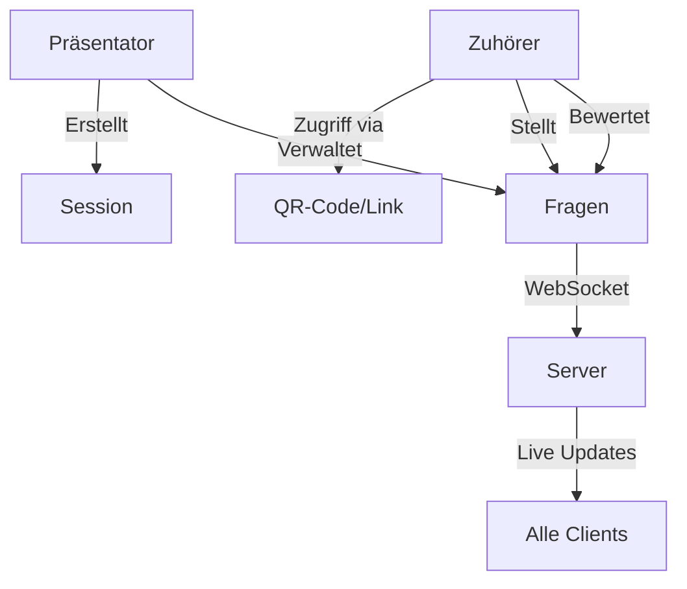
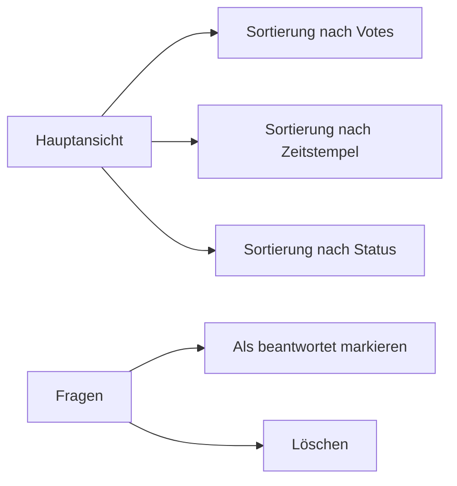
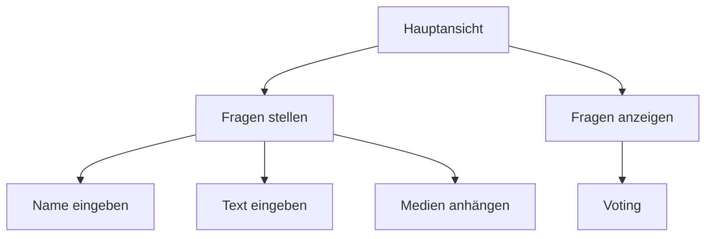
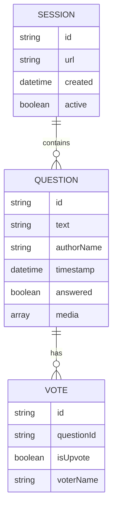

# Spezifikation: Live Q&A Platform für Präsentationen

## Übersicht
Eine Webanwendung, die es Zuhörern ermöglicht, während einer Präsentation Fragen zu stellen und über diese abzustimmen. Die Plattform bietet separate Interfaces für Präsentierende und Zuhörer.

## System-Architektur

## Kernfunktionen

### Zugang & Authentifizierung
- Zugriff über kurzen Link oder QR-Code
- Einfache Namenseingabe ohne Verifizierung für Fragesteller
- Keine Registrierung erforderlich

### Session-Management
- Einfache Session-Erstellung mit automatisch generierter URL
- Session bleibt aktiv bis zum manuellen Beenden
- Keine automatische Archivierung

### Fragen-Management
- Maximale Länge: 500 Zeichen
- Unterstützung für Bilder und Links
- Automatische Anzeige aller Fragen (keine Vormoderation)
- Up- und Downvoting System
- Echtzeit-Aktualisierung via WebSockets

## Benutzeroberflächen

### Präsentationsmonitor-Ansicht

Funktionen:
- Verschiedene Sortieroptionen
- Fragen als beantwortet markieren
- Löschfunktion für unpassende Fragen
- Optimiert für große Displays

### Mobile Ansicht (Zuhörer)

Funktionen:
- Optimiert für mobile Geräte
- Einfaches Formular für neue Fragen
- Übersichtliche Darstellung existierender Fragen
- Intuitive Voting-Funktionen

## Technische Anforderungen

### Echtzeit-Funktionalität
- WebSocket-Verbindung für Live-Updates
- Sofortige Aktualisierung bei:
  - Neuen Fragen
  - Votes
  - Statusänderungen

### Datenmodell

## Sicherheit & Einschränkungen
- Keine Benutzerauthentifizierung erforderlich
- Grundlegende Validierung der Eingaben
- Schutz vor Massenabstimmungen
- Überprüfung von Medieninhalten auf schädliche Dateien

## Skalierung & Performance
- Optimierung für gleichzeitige Nutzung durch mehrere hundert Teilnehmer
- Effiziente WebSocket-Verbindungsverwaltung
- Caching-Strategien für statische Inhalte