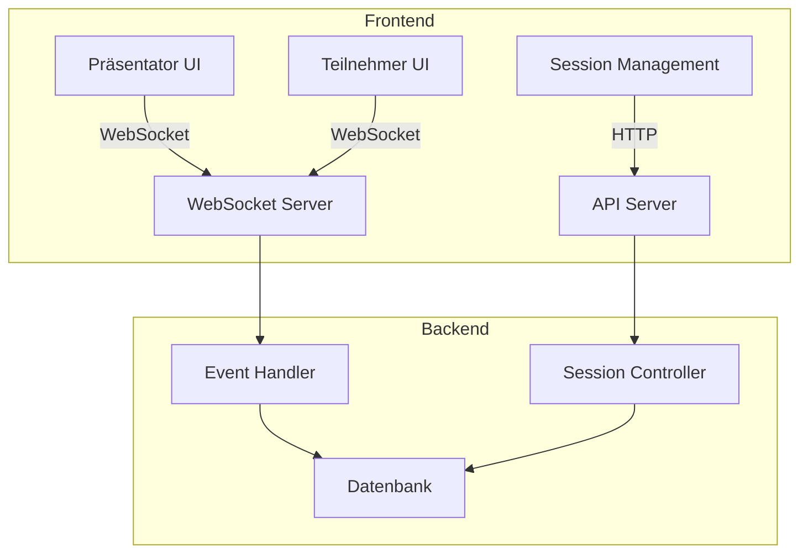

# Technische Spezifikation: Live Q&A Platform

## 1. Systemübersicht

### 1.1 Zweck
Entwicklung einer Echtzeit-Webanwendung für interaktive Fragerunden während Präsentationen, die es Zuhörern ermöglicht, Fragen zu stellen und darüber abzustimmen.

### 1.2 Architektur



## 2. Technische Anforderungen

### 2.1 Frontend-Stack
- Framework: React mit TypeScript
- State Management: Redux für globalen Zustand
- WebSocket-Client: Socket.io-client
- UI-Framework: Material-UI
- Responsive Design: Mobile-first Ansatz

### 2.2 Backend-Stack
- Runtime: Node.js
- Framework: Express.js mit TypeScript
- WebSocket: Socket.io
- Datenbank: MongoDB
- Caching: Redis für Session-Daten

### 2.3 Deployment
- Docker-Container für alle Komponenten
- Nginx als Reverse Proxy
- SSL/TLS-Verschlüsselung
- Horizontale Skalierung über Kubernetes

## 3. Datenmodelle

### 3.1 Session
```typescript
interface Session {
    id: string;              // Unique identifier
    url: string;             // Public access URL
    createdAt: Date;         // Creation timestamp
    isActive: boolean;       // Session status
    presenterToken: string;  // Presenter access token
}
```

### 3.2 Question
```typescript
interface Question {
    id: string;              // Unique identifier
    sessionId: string;       // Reference to session
    text: string;            // Max 500 characters
    authorName: string;      // User provided name
    createdAt: Date;         // Creation timestamp
    isAnswered: boolean;     // Question status
    media?: {                // Optional media attachments
        type: 'image' | 'link';
        url: string;
        thumbnail?: string;
    }[];
    votes: {                 // Vote tracking
        up: number;
        down: number;
    };
}
```

### 3.3 Vote
```typescript
interface Vote {
    id: string;              // Unique identifier
    questionId: string;      // Reference to question
    voterName: string;       // User provided name
    type: 'up' | 'down';     // Vote type
    createdAt: Date;         // Vote timestamp
}
```

## 4. API-Endpunkte

### 4.1 REST-API
```typescript
// Sessions
POST   /api/sessions           // Create new session
GET    /api/sessions/:id       // Get session details
DELETE /api/sessions/:id       // End session

// Questions
GET    /api/questions/:id      // Get question details
DELETE /api/questions/:id      // Delete question
PATCH  /api/questions/:id      // Update question status
```

### 4.2 WebSocket-Events
```typescript
// Client -> Server
interface ClientEvents {
    'join:session': (sessionId: string) => void;
    'submit:question': (question: QuestionInput) => void;
    'submit:vote': (vote: VoteInput) => void;
    'mark:answered': (questionId: string) => void;
}

// Server -> Client
interface ServerEvents {
    'question:new': (question: Question) => void;
    'question:updated': (question: Question) => void;
    'question:deleted': (questionId: string) => void;
    'vote:updated': (questionId: string, votes: Votes) => void;
}
```

## 5. Fehlerbehandlung

### 5.1 Frontend-Fehlerbehandlung
```typescript
interface ErrorResponse {
    code: string;            // Error code
    message: string;         // User-friendly message
    details?: unknown;       // Additional error details
}

enum ErrorCodes {
    NETWORK_ERROR = 'NETWORK_ERROR',
    SESSION_NOT_FOUND = 'SESSION_NOT_FOUND',
    INVALID_INPUT = 'INVALID_INPUT',
    RATE_LIMIT_EXCEEDED = 'RATE_LIMIT_EXCEEDED',
    WEBSOCKET_ERROR = 'WEBSOCKET_ERROR'
}
```

### 5.2 Error Recovery Strategien
- Automatische WebSocket-Reconnection
- Optimistic Updates mit Rollback
- Offline-Queuing von Aktionen
- Progressive Enhancement
- Graceful Degradation bei fehlender WebSocket-Unterstützung

## 6. Performance & Skalierung

### 6.1 Caching-Strategien
- Redis für Session-Daten und aktive Fragen
- Browser-Cache für statische Assets
- Service Worker für Offline-Funktionalität

### 6.2 Lastverteilung
- Horizontale Skalierung der WebSocket-Server
- Sticky Sessions für WebSocket-Verbindungen
- MongoDB Sharding für große Datenmengen

### 6.3 Rate Limiting
```typescript
interface RateLimits {
    questions: {
        windowMs: 60000,     // 1 minute
        max: 5               // 5 questions per minute
    },
    votes: {
        windowMs: 60000,     // 1 minute
        max: 30              // 30 votes per minute
    }
}
```

## 7. Sicherheit

### 7.1 Input-Validierung
```typescript
interface ValidationRules {
    question: {
        text: {
            maxLength: 500,
            minLength: 1
        },
        media: {
            maxFiles: 3,
            allowedTypes: ['image/jpeg', 'image/png'],
            maxSize: 5242880  // 5MB
        }
    }
}
```

### 7.2 Sicherheitsmaßnahmen
- XSS-Schutz durch Content-Security-Policy
- CORS-Konfiguration
- Rate Limiting
- Sanitization aller User-Inputs
- Validierung von Media-Uploads

## 8. Testplan

### 8.1 Unit Tests
- Frontend-Komponenten (Jest + React Testing Library)
- API-Endpunkte
- WebSocket-Events
- Datenmodell-Validierung

### 8.2 Integration Tests
```typescript
describe('Question Workflow', () => {
    it('should create question and notify all participants');
    it('should handle voting and update counts in realtime');
    it('should mark questions as answered');
    it('should handle media uploads');
});
```

### 8.3 End-to-End Tests (Cypress)
- Session Creation Flow
- Question Submission Flow
- Voting Flow
- Presenter Management Flow
- WebSocket Reconnection
- Offline Functionality

### 8.4 Performance Tests
- WebSocket Connection Handling (1000+ simultaneous connections)
- Message Broadcasting Latency
- Database Query Performance
- Rate Limiting Effectiveness

## 9. Implementierungsplan

### 9.1 Phase 1: Grundfunktionalität
1. Backend-Setup (Express + Socket.io)
2. Datenbank-Integration
3. Basic Frontend-Setup
4. Session Management
5. Basis-Fragen-Funktionalität

### 9.2 Phase 2: Erweiterte Funktionen
1. Voting-System
2. Media-Upload
3. Presenter Interface
4. Mobile Optimierung
5. Offline-Funktionalität

### 9.3 Phase 3: Optimierung
1. Performance-Optimierung
2. Skalierbarkeit
3. Monitoring-Setup
4. Security Hardening
5. Dokumentation

## 10. Monitoring & Logging

### 10.1 Metriken
```typescript
interface Metrics {
    sessions: {
        active: number,
        total: number
    },
    questions: {
        perSession: number,
        totalActive: number
    },
    websocket: {
        connections: number,
        messageRate: number,
        latency: number
    }
}
```

### 10.2 Logging
- Request Logging (Morgan)
- Error Logging (Winston)
- WebSocket Event Logging
- Performance Monitoring
- User Activity Tracking

## 11. Deployment & DevOps

### 11.1 Docker-Konfiguration
```dockerfile
# Frontend
FROM node:18-alpine
WORKDIR /app
COPY package*.json ./
RUN npm install
COPY . .
RUN npm run build

# Backend
FROM node:18-alpine
WORKDIR /app
COPY package*.json ./
RUN npm install --production
COPY . .
CMD ["npm", "start"]
```

### 11.2 Kubernetes-Deployment
- Separate Pods für Frontend, Backend, Redis und MongoDB
- Horizontal Pod Autoscaling
- Rolling Updates
- Health Checks
- Resource Limits

## 12. Dokumentation

### 12.1 API-Dokumentation
- OpenAPI/Swagger Spezifikation
- WebSocket Event-Dokumentation
- Authentifizierung & Autorisierung
- Beispiel-Requests & Responses

### 12.2 Entwickler-Dokumentation
- Setup-Anleitung
- Architektur-Übersicht
- Coding Standards
- Testabdeckung
- Deployment-Prozess